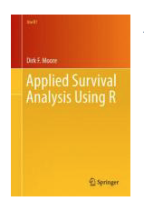

```{r setup, include=FALSE}
knitr::opts_chunk$set(echo = TRUE, message=FALSE, warning=FALSE)
library(tidyverse)
library(survival)
```


## Survival Analysis

- Outcome variable: Time until an event occurs

- Start follow-up $\overset{\text {Time}}\longrightarrow$ Event

- Event examples: death; disease; recovery; purchase.

- Time is often called survival time since it's the time that an individual has survived over some follow-up period.


## Censored Data

- Censoring occurs when we have some information about individual survival time, but it's not exactly known.

- Consider a person followed in a medical study until they die.  If the study ends while the patient is still alive then the patient's survival time is censored, since the person will die after the study ends.

- Common reasons why censoring may occur:
   + study ends - no event
   + lost to follow-up
   + withdraw from study


## Survival Data

The data below is from Pancreas cancer patients in TCGA.

```{r, echo=FALSE}
library(kableExtra)
clinical <- read_delim("clinical.cart.2020-01-26/clinical.tsv", 
                       "\t", escape_double = FALSE, trim_ws = TRUE) %>% distinct(case_id, .keep_all = T)
clinical %>% select(days_to_last_follow_up, days_to_death, vital_status) %>% head() %>% kable() %>% kable_styling()
```


How can observed survival time be defined?


## Survival Data

```{r, echo=FALSE}
clinical %>% select(days_to_last_follow_up, days_to_death, vital_status) %>% head() %>% kable() %>% kable_styling()
```


- If `vital_status = Dead` and `days_to_death` is not missing then $T =$ `days_to_death`.

- If `vital_status = Alive` and `days_to_last_follow_up` is not missing then $T=$ `days_to_last_follow_up`.

- If a person is still alive during the study period then they are censored; if the person died then the event occured.

## Survival Data - Define Survival Time

Define survival time:

```{r}
clinical$os_days <- ifelse(clinical$vital_status == "Alive", 
                           clinical$days_to_last_follow_up,
                           ifelse(clinical$vital_status == "Dead", 
                                  clinical$days_to_death, NA))
```

```{r, echo=FALSE}
clinical %>% select(days_to_last_follow_up, days_to_death, vital_status, os_days) %>% head() %>% kable() %>% kable_styling()
```

## Survival Data - Define Censoring

Define event indicator for subject $i$:

$$\delta_i=
\left\{
	\begin{array}{ll}
		1  & \mbox{if death} \\
		0 & \mbox{if censored}
	\end{array}
\right. $$

```{r}
clinical$dead <- ifelse(clinical$vital_status == "Alive", 0, 
                        ifelse(clinical$vital_status == "Dead", 1, NA))
```

```{r, echo=FALSE}
clinical %>% select(days_to_last_follow_up, days_to_death, vital_status, os_days, dead) %>% head() %>% kable() %>% kable_styling()
```


## Survivor Function

- Let $T \ge 0$ be a random variable for a person's survival time. 
- $S(t)=P(T>t)= 1- F(t)$ is the survivor function.
- For example, if $T \sim exp(\lambda)$ then $S(t)$ for $\lambda =1/2$ is

```{r, echo=FALSE, fig.height=3}
f <- function(x){1-pexp(x)}
ggplot(data.frame(x = c(0,5)), aes(x)) + stat_function(fun = function(.x) 1- pexp(.x, rate = 0.5)) + 
   labs(title  = "Exponential Survival Function with rate = 0.5") + ylab(label = "S(t)") + xlab(label = "t")
```

- Observed survival function and exponential survival with $\lambda=1/2$.

```{r, echo=FALSE, fig.height=3}
df <- data.frame(s = c(1, 0.8, 0.75, 0.5, 0.45, 0.3, 0.28, 0.22), t = c(0, 0.8, 1, 2.1, 2.8, 3.7, 3.9, 4.1))
df %>% ggplot(aes(t,s)) + geom_step() + labs(title  = "Observed Survival Function") + ylab(label = "Observed S(t)") + xlab(label = "t") + stat_function(fun = function(.x) 1- pexp(.x, rate = .2), colour = "red")
```

## Hazard Function

The hazard function is defined as:

$$h(t)= \lim_{\Delta t \rightarrow 0} \frac{P(t \le T < t + \Delta t | T \ge t)}{\Delta t}.$$

- $h(t)\Delta t \approx P(t \le T < t + \Delta t | T \ge t)$ - the probability of death in $(t, t + \Delta t)$ given survival up to time $t$.
- For example, if time is measured in days then $h(t)$ is the approximate probability that an individual who is alive on day $t$, dies in the following day.

## Non-parametric Estimation of the Survival Function

$$\hat S(t) = \frac{\text{Number of individuals with survival times} \ge t}{\text{Number of individuals in data set }}.$$

- The Kaplan-Meier estimate is an example of a procedure for estimating $\hat S(t)$.  

## Kaplan-Meier


```{r}
km <- survfit(Surv(time, status) ~ 1, data = leukemia)
summary(km)
```

## Kaplan-Meir

```{r}
library(survminer)
ggsurvplot(km)
```


## Proportional Hazards Model

- Suppose we have two groups of patients: $A$ and $B$.
- Assume the hazard for at time $t$ for a patient in $B$ is proportional to the hazard at time $t$ for a patient in group $A$.  That is,

$$h_{B}=\psi h_A(t),$$
where $t \geq 0$ and $\psi$ is a constant.

- It's convenient to set $\psi=\exp(\beta)$, since the ratio .  Let $x_i = 1$, if subject is in $B$ and $x_i = 0$, if subject is in $A$ then 

$$h_i(t)=\exp(\beta x_i) h_0(t),$$

This is the proportional hazards model for comparing two groups, with $\psi = \exp(\beta x_i).$

##  General Proportional Hazards Model

- Suppose that we would like to model the hazard of death at particular time as a linear function of $p$ explanatory variables: $x_1,\ldots, x_p$.
- In this case,

$$\psi_i = \beta_1 x_{1i} + \cdots + \beta_p x_{pi}.$$
So,

$$h_i(t)=\exp(\beta_1 x_{1i} + \cdots + \beta_p x_{pi}) h_0(t),$$
or,

$$\log\left\{\frac{h_i(t)}{h_0(t)}\right\} = \exp(\beta_1 x_{1i} + \cdots + \beta_p x_{pi}).$$

- A linear model for the logarithm of the hazard ratio.

## Fitting the proportional Hazards model

- Cox(1972) derived the appropriate likelihood for this model.
- MLE of the $\beta$ parameters can be found by maximizing the log-likelihood function using numerical methods such as Newton-Raphson.

## Fitting the proportional Hazards model

```{r}
cox.mod <- coxph(Surv(time, status) ~ x, data = leukemia)
summary(cox.mod)
```

- The estimated hazard ratio of patients not given maintenance chemotherapy vs. patients given maintenance chemotherapy is 2.4981. 

$$\hat h_{\text{non-maintenance}}(t) = \exp(0.9155) \hat h_{\text{maintenance}}(t) $$

## Cox Model Diagnostics

- Graphical approaches such as log-log plots.
- Goodness of fit tests such as Schoenfield residual plot

## Book Reference

[UofT lib link to Applied Survival Analysis using R](http://go.utlib.ca/cat/10487946)

# Unsupervised Learning

- k-means
- Hierarchical Clustering
- Priciple Component Analysis


## Lukemia Survival Times

Survival in patients with Acute Myelogenous Leukemia. The question at the time was whether the standard course of chemotherapy should be extended ('maintainance') for additional cycles.

```{r, echo=FALSE}
library(survival)
library(tidyverse)

leukemia %>% head( n = 3)
```


`time`:	survival or censoring time

`status`:	censoring status

`x`:	maintenance chemotherapy

## Lukemia Survival Times

```{r, echo=FALSE}
leukemia %>% head( n = 3)
```

- The third observation has a status of 0. 
- Person was followed for 13 months and after that was lost to follow up. 
- So we only know that the patient survived AT LEAST 13 months, but we have no other information available about the patient's status.  
- This type of censoring (also known as "right censoring") makes linear regression an inappropriate way to analyze the data due to censoring bias.

## Lukemia Survival Times

```{r, fig.height=3}
library(survival)
library(tidyverse)

leukemia %>% ggplot(aes(time)) + 
  geom_histogram(colour = "black", 
                 fill = "grey", bins = 10)
```


## Survival Analysis in R

```{r, eval=FALSE}
Surv(time, status)
```

creates the dependent variable for a survival object in a survival model.

## Survival Analysis in R

```{r}
library(broom)
library(survminer)
km <- survfit(Surv(time, status) ~ 1, data = leukemia)
tidy(km) %>% head(3) %>% rename(survival = estimate)
```

- At time 9 the probability of survival is:

```{r}
((23 - 2)/23)*((21 - 2)/21)*((19 - 1)/19)
```

## Survival Analysis in R

```{r}
tidy(km) %>% head(6) %>% rename(survival = estimate)
```

- At time 16 there are 17 - 1 - 1 = 15 people at risk since one person was censored at time 13.

## Kaplan - Meir Analysis

```{r}
library(survminer)
ggsurvplot(km, data = leukemia, risk.table = T)
```

## Comparing Survival Curves 

```{r}
kmx <- survfit(Surv(time, status) ~ x, data = leukemia)
ggsurvplot(kmx, data = leukemia, risk.table = T)
```


## Comparing Survival Curves 

###  Log-Rank Test

$H_0$: There is no difference in the survival function between those who were on maintenance chemotherapy and those who weren't on maintenance chemotherapy.

$H_a$: There is a difference in the survival function between those who were on maintenance chemotherapy and those who weren't on maintenance chemotherapy.

## Comparing Survival Curves 

###  Log-Rank Test


```{r}
survdiff(Surv(time, status) ~ x, data = leukemia)
```

